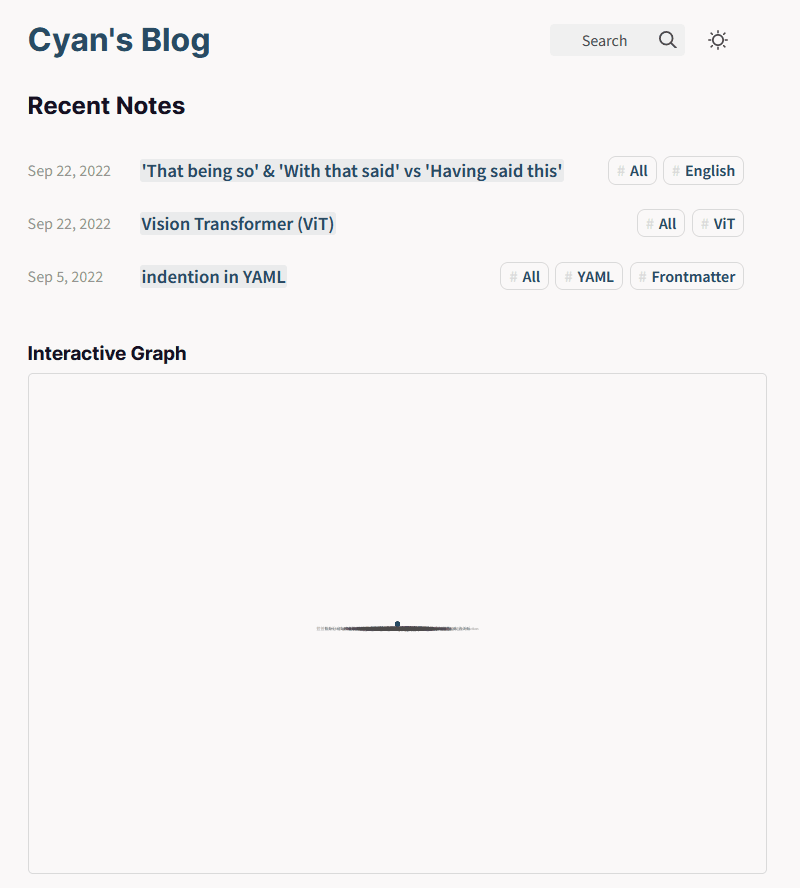

# Cyan's Blog

Welcome!🎉 I'm Cyan Fu, a master student at Carnegie Mellon University studying Artificial Intelligence. 

I write about anything and everything here, and my main interest lies in the intersection of AI and 3D vision. I hope you find something new here!

🔗Starts your journey [**Here**](https://alonelysheep.github.io/quartz-blog/)

> “[One] who works with the door open gets all kinds of interruptions, but [they] also occasionally gets clues as to what the world is and what might be important.” — Richard Hamming

This blog is built with [Quartz](https://github.com/jackyzha0/quartz), an amazing static site generator for hosting digital garden.