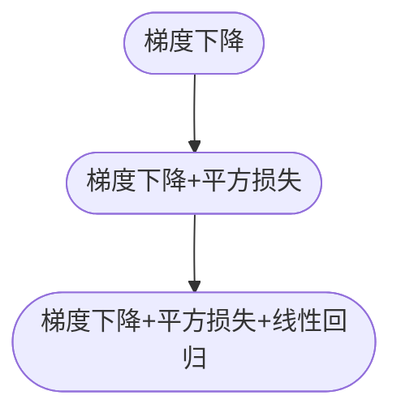

# 梯度下降法和线性回归的关系

 2021-08-05

Tags: #MachineLearning #LinearRegression  #GradientDescent

- 梯度下降法公式
$$
\begin{array}{l}
\text { repeat until convergence }\{\\
\begin{array}{cc}
\theta_{j}:=\theta_{j}-\alpha \frac{\Large\partial}{\Large\partial \Large\theta_{j}}   J\left(\theta_{0},\cdots ,\theta_{n}\right) & \text { (simultaneously update } 
j=0, \cdots ,j=n)
\end{array}\\
\text { \} }
\end{array}
$$

---
- 梯度下降 + Cost Function=平方损失
$$J\left(\theta_{0},\cdots ,\theta_{n}\right)=\frac{1}{2 m} \sum_{i=1}^{m}\left(\hat{y}^{(i)}-y^{(i)}\right)^{2}=\frac{1}{2 m} \sum_{i=1}^{m}\left(h_{\theta}\left(x^{(i)}\right)-y^{(i)}\right)^{2}$$

所以

$$
\frac{\partial}{\partial \theta_{j}} J(\theta) 
=\frac 1 m \sum_{i=1}^{m} \left(h_{\theta}(x^{(i)})-y^{(i)}\right) f_{j}(x^{(i)}) 
$$

公式变为:
$$
\begin{array}{l}
\text { repeat until convergence }\{\\
\begin{array}{cc}
&\theta_{j}:=\theta_{j}-\alpha \frac 1 m \sum_{i=1}^{m} \left(h_{\theta}(x^{(i)})-y^{(i)}\right) f_{j}(x^{(i)}) 
\end{array}\\
\text { \} }
\\\\ \text { (simultaneously update } 
j=0, \cdots ,j=n)
\end{array}
$$
---
- 梯度下降 + 平方损失 + Hypothesis Function=线性回归

	对于我们的线性回归问题, $f_j(x^{(i)})=x_j^{(i)}$
	
	公式变成了: ^fe416b

$$
\begin{array}{l}
\text { repeat until convergence }\{\\
\begin{array}{cc}
&\theta_{j}:=\theta_{j}-\alpha \frac 1 m \sum_{i=1}^{m} \left(h_{\theta}(x^{(i)})-y^{(i)}\right) x_j^{(i)} 
\end{array}\\
\text { \} }
\\\\ \text { (simultaneously update } 
j=0, \cdots ,j=n)
\end{array}
$$