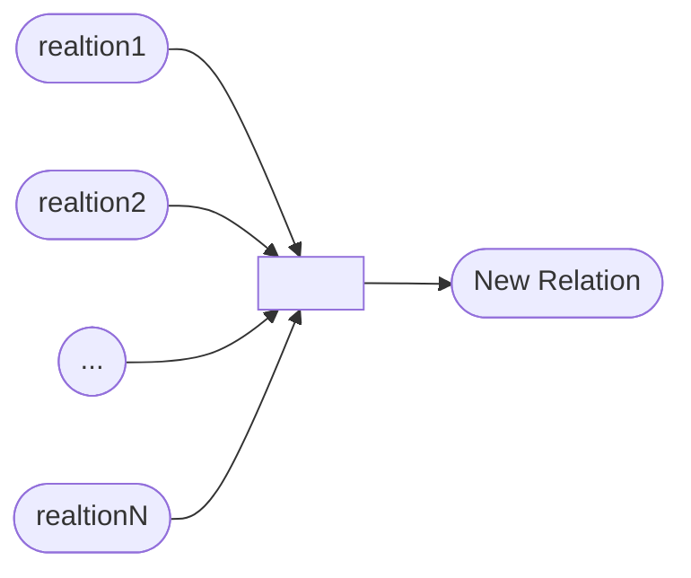

# Course Intro & Relational Algebra

<div align="right"> 2021-09-08</div>

Tags: #Database 
 
## Overview
- 这门课是关于数据库的DBMS的设计和实现的, 而不是关于如何使用一个数据库的
- 2 classes per week, supplementary  reading  materials.

- TextBook: Database System Concepts: The best among all the textbooks - Andy Pavlo

- Project: build your own storage manager from scratch. A relatively complex software yet not a full-fledged system. Domino-way of building. 


## Database

a collection of data that's related together in some way that's try's to model some aspects of real world. 
a useful database is the one which you can ask question about it.

Flat Files:
- CSV File: Comma Separated Value File
	- 
	- If we want to find out which year the artist "Ice Cube" went solo,  we could write the following python code to iterate through the file above:
```py
for line in file:
	record = parse(line)
	if record[0]=="Ice Cube": 
		print int(record[1])
 ```
- Implementation
	- However, there could be many issues in this way of storing information.
	- For example, this method is slow and becomes problematic when sharing data between programs(e.g. write to the same file at the same time).
- Durability Problems
- Data Integrity Problems

DBMS:
- Allows apps to store and analyze info in a database
- 不用重复造轮子
- We'll focus on In-disk DB
- Definition, Creation, Query, Update and Administration of databases are the essential functionalities of a general-purpose DBMS. 

### History of DBMSs
- **Early Stage**
	Tight coupling between logical and physical layers.
	- People: Ted Codd - Purposed Relational Model

**Data Model**: a collection of concepts for describing the data in a database. -> The Higher Concept
**Schema**: a description of a particular collection of data, Using a given data model. -> The Actual Plan
- **There are a bunch of data models:**
	- 
	- 
	- 
	- 

**Relational Model: Three Parts**
- Structure: The definitions of relations and their contents.
- Integrity: Ensure the database's contents satisfy constraints.
- Manipulation: How to access and modify a database's contents

**Relation: Definition**
Unordered set that contain the relation of attributes that represent entities.

- Tuple: a set of attribute values(Domains) in the relation.(所以Tuple不只是三元组哈)
- `NULL`可以放入任何Domain

**Primary Key**
Uniquely identify a single tuple.

## DML: Data Manipulation Languages
有两种:
- Procedural: 描述DBMS应该怎么找到目标数据
	- 对应 **Relational Algebra** ->我们这门课研究的对象
- Non-Procedural: 描述需要什么数据, 但是不给出怎么找到这些数据.
	- 对应Relational Calculus


## Relational Algebra
Describe the fundamental operations to retrieve and manipulate tuples in a relation(Based on Set Algebra)


关系代数是Procedural的, 描述的是筛选数据所要进行的操作.

在课件里面介绍了以上操作:
- Select
- Projection
- Union
- Intersection
- Difference
- Product
- Join

- 在课件里面举了一个例子, 如果我们用Procedural Language(比如 关系代数)来描述我们需要的数据, 那么可能会出现效率低的情况, 最佳的策略是描述我们需要的数据(Non-Procedural的), 让DBMS来决定怎样查找效率高, 这也是现在数据库里面的现行标准.(*de facto* standard)


